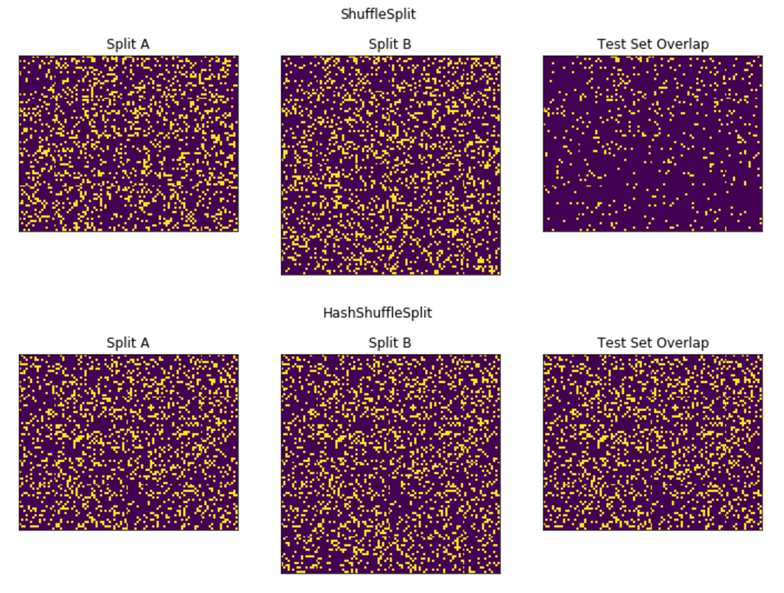

# hashsplit
## Train / test splits based on (re-)hashed labels

Often in machine learning we want to build not just one model but multiple iterations of models whilst the underlying data grows over time. To make comparing these models as simple as possible, we want to be able to create a number of train and test sets at time t1 and again later at time t2 and maximise the overlap between each train and test set. This package contains two cross-validators with sklearn 0.18+ interface that achieve this.

See example notebook for more information.
